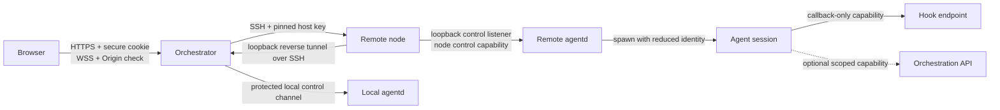

# Flock Elite Code and Agent Security Plan

> **Status:** Draft for review
>
> **Created:** 2026-07-11
>
> **Target baseline:** Flock v0.3.0
>
> **Execution model:** Implement and review one task at a time. Do not treat this
> document as authorization to execute every phase at once.

## 1. Purpose

This plan combines the findings from two July 2026 reviews:

1. A code-quality and production-readiness audit covering dead code, duplication,
   module boundaries, durability, bundle weight, tests, CI, documentation, and
   operations.
2. An agent-communications security review covering browser connections, SSH node
   transport, agentd, hook callbacks, WebSockets, credentials, capability tokens,
   and the blast radius of a compromised agent.

The goal is not merely to make the repository look tidy. The goal is to make Flock:

- secure when an agent executes hostile repository code;
- predictable across desktop, mobile, restarts, upgrades, and multiple nodes;
- modular enough that changes remain local and testable;
- free of abandoned compatibility paths and speculative APIs;
- measurable, with quality and security properties enforced automatically;
- recoverable when infrastructure, state, or an upgrade fails;
- understandable to a new contributor without relying on historical context.

## 2. Current baseline

The codebase already has a strong foundation. This plan must preserve it.

### Verified strengths

- No circular TypeScript dependencies were found across 475 analyzed files.
- Measured duplication was approximately 0.17% across TypeScript, TSX, Go, CSS,
  JavaScript, and Markdown production sources.
- Go `staticcheck ./...` passed.
- Go `test -race ./...` passed, including the session and server packages.
- TypeScript builds, typechecking, linting, formatting, unit tests, deployment
  integration tests, npm audit, Go vet/tests/vulnerability checks, action linting,
  secret scanning, and local Docker image builds passed during the v0.3.0 hardening
  pass.
- Remote-node transport uses SSH, SSH host-key pinning after first contact,
  loopback-only agentd listeners, and loopback-only reverse hook tunnels.
- Passwords use Argon2id. SSH credentials use AES-256-GCM authenticated encryption
  at rest with key-version support.
- Hook tokens are 256-bit random values. Only their SHA-256 hashes are persisted,
  and comparison is constant-time.
- Browser production traffic is designed to use Caddy TLS, secure HTTP-only
  SameSite cookies, a default-deny HTTP guard, authenticated WebSockets, Origin
  checks, and per-session WebSocket authorization.
- Agentd limits frame size, bounds write time, survives connection-handler panics,
  and strips its control secret from spawned agents' environments.

### Concentrated debt

The repository is not broadly low quality. Its remaining debt is concentrated in:

- the trust boundary between agentd and agents running under the same OS identity;
- an overly broad per-session agent token;
- public API exposure of token material that the browser does not need;
- compatibility and product surfaces that no longer match the greenfield,
  single-user direction;
- five especially large composition/UI/protocol modules;
- client state that is split unpredictably between PostgreSQL, memory, and browser
  local storage;
- integration and end-to-end suites that exist but do not gate CI or releases;
- missing recovery, diagnostics, and performance budgets;
- historical documentation that can contradict the current implementation.

## 3. Threat model and product boundary

Every security task depends on agreeing to this boundary first.

### Recommended threat model

- Flock has one trusted human operator per installation.
- The operator's browser, orchestrator host, master key, and Flock administrative
  account are trusted.
- Tailnet membership is not sufficient authorization by itself. Flock login and
  application authorization remain required.
- Remote nodes may be administered by the operator, but repository contents,
  package scripts, build tools, coding-agent output, MCP servers, and subprocesses
  launched by an agent are **potentially hostile**.
- One compromised agent must not gain implicit control over other agents, other
  projects, Flock's control plane, SSH credentials, the Docker host, or the master
  key.
- Root on the orchestrator host or root on a remote node remains outside the
  isolation guarantee. Root compromise is installation compromise.
- Multi-tenant isolation between mutually untrusted human users is out of scope.
  Code implying supported multi-user tenancy should be removed unless this decision
  changes.

### Security invariants

The finished system must enforce these properties:

1. **Transport confidentiality:** browser, SSH, hook, and daemon traffic is encrypted
   outside a single-host process/socket boundary.
2. **Control-plane separation:** an agent process cannot authenticate to the node-wide
   agentd control channel.
3. **Least privilege:** an agent receives only capabilities explicitly required for
   that session.
4. **Project isolation:** a session cannot read or mutate another project through any
   agent-facing API.
5. **Session isolation:** callback capability for session A cannot post events for,
   attach to, or control session B.
6. **No browser token exposure:** agent-only plaintext tokens and token hashes never
   appear in browser-visible responses, logs, URLs, analytics, or query caches.
7. **Fail closed:** missing credentials, invalid ownership, unsupported sandboxing,
   malformed frames, and invalid Origin configuration deny the operation.
8. **Explicit insecure mode:** development shortcuts are visibly marked, bound to
   private interfaces, and impossible to activate accidentally in production.
9. **Recoverability:** durable state and secrets have a tested backup and restore
   story before destructive upgrades are considered safe.
10. **Measurability:** CI contains negative tests proving the boundaries, not only
    success-path tests.

## 4. Communication model

The solid arrows are required paths. The dotted orchestration capability must be
optional and separately authorized; it must not be implied by callback access.

## 5. Execution principles

- Complete Phase 0 before implementation work begins.
- Security boundary changes take precedence over aesthetic refactors.
- Refactor behind tests; do not mix behavior changes and mechanical file moves when
  they can be reviewed separately.
- Delete obsolete behavior instead of maintaining compatibility shims. This is a
  greenfield, pre-1.0 project.
- Every destructive database migration requires a verified backup and a documented
  rollback or restore procedure, even before the full backup product exists.
- Do not use file-length targets as the definition of modularity. A split is complete
  when responsibilities and dependency direction are clear.
- A task is not complete because unit tests pass. Use the validation level appropriate
  to the risk: unit, integration, adversarial, browser, Docker, remote-node, or restore.
- Keep the repository runnable at every task boundary.

## 6. Phase summary

| Phase | Theme                                      | Primary outcome                                                                |
| ----- | ------------------------------------------ | ------------------------------------------------------------------------------ |
| 0     | Baseline and decisions                     | Reproducible checkpoint and approved boundaries                                |
| 1     | Immediate token and WebSocket hardening    | Remove avoidable exposure without architectural migration                      |
| 2     | Agentd privilege separation                | A compromised agent cannot access node-wide control                            |
| 3     | Scoped agent capabilities                  | Callback and orchestration authority are separated and auditable               |
| 4     | Dead code and compatibility purge          | Product surface matches the current single-user greenfield design              |
| 5     | Durable state and client data layer        | Cross-device consistency and one robust API client                             |
| 6     | Modular refactoring                        | Smaller, cohesive modules with enforceable dependency boundaries               |
| 7     | CI and quality gates                       | Integration, E2E, security, race, dead-code, and size checks block regressions |
| 8     | Performance and accessibility              | Fast, measurable, mobile-safe, keyboard-accessible UI                          |
| 9     | Recovery, observability, and operations    | Backup, restore, diagnostics, and background failure visibility                |
| 10    | Public documentation and release integrity | Current public docs and transactional, verified releases                       |

---

## Phase 0 — Baseline and architectural decisions

### P0.1 — Create a clean v0.3.0 checkpoint

**Priority:** Blocking

**Implementation status:** Complete in `bfc7023` (pushed to `main`)

**Why**

The current hardening and formatting pass spans hundreds of files. Beginning security
or architecture work on top of an uncommitted mechanical change makes review,
reversion, and blame unnecessarily risky.

**Tasks**

- Review the current worktree for accidental or unrelated changes.
- Repeat the full existing validation suite.
- Commit the public-release, formatting, Fleet Scope removal, Docker, documentation,
  and v0.3.0 changes as one clearly described checkpoint or a small reviewed series.
- Tag or otherwise record the exact pre-security-refactor commit.
- Record generated image digests when v0.3.0 images are built.

**Definition of done**

- `git status` is clean.
- The checkpoint is present on `main` and remotely recoverable.
- The commit passes every existing build and test gate.
- Subsequent phases can be reverted independently without reverting v0.3.0.

**Testing and validation**

- `pnpm format:check`
- `pnpm -r build`
- `pnpm -r typecheck`
- `pnpm lint`
- `pnpm test:unit`
- `pnpm test:int`
- `go vet ./...`, `go test ./...`, and `govulncheck ./...`
- Docker Compose production configuration validation
- Local orchestrator/web/session-browser image builds
- Clean PostgreSQL migration and health smoke test

### P0.2 — Approve the threat model and single-user boundary

**Priority:** Blocking

**Implementation status:** Complete; see
`docs/decisions/security-threat-model.md`

**Why**

The code currently contains both single-user product assumptions and member/admin
multi-user APIs. Security cannot be evaluated consistently while those boundaries are
ambiguous.

**Tasks**

- Approve or revise the recommended threat model in Section 3.
- Confirm that hostile repository code and compromised agents are in scope.
- Confirm that human multi-tenancy is out of scope.
- Decide whether agent-to-agent orchestration is disabled by default, enabled per
  project, or enabled per session. Recommended: disabled by default and enabled per
  session/project through an explicit policy.
- Document which deployment modes are supported:
  - production HTTPS through Caddy;
  - private Tailnet development;
  - localhost development;
  - unsupported direct-LAN/public HTTP.

**Definition of done**

- An ADR records the approved trust boundaries and deployment modes.
- README and security documentation use the same language.
- Every later task can cite a specific approved invariant.

**Testing and validation**

- Architecture/security review of the ADR.
- Tabletop scenarios: malicious repository script, stolen hook token, compromised
  agent, malicious tailnet device, changed SSH host key, and lost master key.

### P0.3 — Select the agentd privilege-separation architecture

**Priority:** Blocking for Phase 2

**Implementation status:** In progress. Architecture accepted in
`docs/decisions/agentd-privilege-separation.md`; the root/control/agent identity
split, protected credential and socket, PTY privilege drop, Docker production
smoke, and local adversarial boundary tests are implemented. Clean remote-VM,
reboot, and failed-upgrade exercises remain before the spike is complete.

**Why**

The present user-mode daemon and its child agents share an OS identity. Merely moving
the secret to a different environment variable does not create a boundary; same-UID
processes can often read the same files and may inspect process state.

**Required design outcomes**

- Agentd control credentials are inaccessible to agent processes.
- Agentd can launch PTYs under a reduced agent identity.
- The orchestrator can upgrade and reconnect without exposing the credential.
- Local Docker and remote Linux nodes follow the same security model where practical.
- The design does not require agents to receive a node-wide credential.

**Recommended architecture to evaluate**

- Install agentd as a system service under a dedicated control identity or a narrowly
  privileged service capable of dropping to an unprivileged agent UID/GID.
- Store control credentials in a root/control-owned file outside the agent user's
  home.
- Bind the Unix socket or loopback listener so only the control identity can use it.
- Spawn every session with explicit UID/GID, sanitized environment, working-directory
  allowlist, resource limits, and optional Landlock confinement.
- For the local Docker deployment, separate orchestrator/control and agent runtime
  identities; do not run the web control plane and agent commands as the same user.

**Spike tasks**

- Prototype privilege drop with a PTY and verify terminal ownership/resizing.
- Prototype installation and upgrades on Ubuntu/Debian without leaving a reusable
  broad `sudo` rule.
- Prototype the local container identity split.
- Test whether systemd hardening options conflict with PTY, transcript, or workspace
  access.
- Write an ADR comparing system service, sidecar, and user-service alternatives.

**Definition of done**

- The ADR chooses one architecture and documents rejected alternatives.
- A working spike proves PTY creation, resize, reconnect, transcript/status capture,
  upgrade, shutdown, and privilege drop.
- An agent shell cannot read the control secret or connect to the control channel.
- Required installation privileges and supported distributions are documented.

**Testing and validation**

- Automated negative test executed as the agent UID attempts to read the secret.
- Automated negative test executed as the agent UID attempts to open the control
  socket/listener.
- Positive control test executed as the orchestrator/control identity.
- `ps`, `/proc`, inherited file descriptor, environment, and filesystem exposure
  review.

---

## Phase 1 — Immediate token and WebSocket hardening

These tasks reduce exposure without waiting for the larger agentd redesign.

### S1.1 — Remove agent tokens and token hashes from browser DTOs

**Priority:** Critical

**Why**

The create-session endpoint returns the plaintext hook token even though the browser
does not consume it. Session list/create responses also use an internal Session model
that includes `hookTokenHash`. A high-entropy hash is not realistically reversible,
but neither value belongs in an untrusted presentation layer.

**Tasks**

- Define separate internal session records and public `SessionView` contracts.
- Remove `hookToken` from `CreateSessionResponse`.
- Remove `hookTokenHash` and other control-plane-only fields from every public REST,
  WebSocket, event, and browser cache payload.
- Keep the plaintext token inside the orchestrator creation flow long enough to seed
  the agent environment, then release the reference.
- Review structured logs and errors for token/hash serialization.
- Add a denylist regression assertion for secret-shaped fields in public payloads.

**Definition of done**

- No browser-visible response contains `hookToken`, `hookTokenHash`, agentd secrets,
  SSH credentials, credential references, or master-key material.
- Session creation and hook delivery still work end to end.
- Browser source, TanStack caches, and network traces contain no agent token.

**Testing and validation**

- Contract tests proving secret fields are absent.
- REST integration tests for list/create/update responses.
- Playwright network-response inspection during session creation.
- Repository search for secret field names in web-facing schemas.
- Manual browser DevTools verification.

### S1.2 — Remove null-owner and implicit-admin WebSocket compatibility

**Priority:** High

**Why**

The current authorizer allows any authenticated user to access a session with a null
owner and allows admins to bypass ownership. The product is greenfield and single
user; legacy permissiveness should not survive as hidden policy.

**Tasks**

- Require every created session to have a non-null owner.
- Reject a WebSocket upgrade when the session does not exist or has no owner.
- Decide whether the sole installation owner may access all sessions by explicit
  policy rather than an inherited multi-user role bypass.
- Make `created_by` non-null after existing data is repaired or removed.
- Remove comments, tests, and branches describing legacy null ownership.

**Definition of done**

- Unknown, closed, null-owner, and wrong-owner session upgrades fail closed.
- Shell-pane derived IDs resolve only to a valid owned base session.
- Database constraints prevent recurrence.

**Testing and validation**

- Unit tests for every authorization branch.
- WebSocket integration tests for PTY, screencast, status, and malformed shell IDs.
- Migration test against representative pre-change data.

### S1.3 — Replace the insecure Origin bypass with an explicit allowlist

**Priority:** High

**Why**

`FLOCK_INSECURE_COOKIES=1` currently disables WebSocket Origin validation. Tailscale
encrypts the network path, but it does not turn every webpage opened by the user into a
trusted Origin.

**Tasks**

- Separate cookie transport configuration from allowed WebSocket Origins.
- Add `FLOCK_ALLOWED_ORIGINS` supporting exact origins only.
- Populate development defaults explicitly for localhost and the chosen Tailnet URL.
- Reject startup in production when `PUBLIC_BASE_URL` or the Origin policy is missing
  or malformed.
- Log the active security mode once at startup without logging secrets.
- Prefer Tailscale HTTPS/MagicDNS or Caddy HTTPS over raw Tailnet-IP HTTP.

**Definition of done**

- Insecure cookies never imply unrestricted Origin acceptance.
- Cross-origin WebSocket attempts fail in all modes.
- The supported localhost, Tailnet, and production URLs work without ad hoc bypasses.

**Testing and validation**

- Unit matrix for exact match, wrong scheme, wrong port, malformed Origin, missing
  Origin for non-browser clients, and forwarded hosts.
- Browser E2E from an intentionally foreign Origin.
- Production configuration startup-failure tests.

### S1.4 — Add endpoint rate limits and abuse bounds

**Priority:** High

**Why**

Login has a narrow in-memory throttle, while hook and orchestration endpoints lack a
general request budget. A stolen token should not allow unbounded event spam, sends,
waits, or kill/restart loops.

**Tasks**

- Add bounded per-IP login limits and per-session hook/orchestration limits.
- Separate inexpensive hook telemetry limits from destructive orchestration verbs.
- Preserve the existing per-project spawn cap and sliding-window spawn limit.
- Bound concurrent long-poll waits per session/project.
- Return consistent `429` responses with `Retry-After`.
- Bound and periodically evict throttle maps.
- Add metrics/audit entries for sustained rejection without logging token values.

**Definition of done**

- Every public or token-authenticated endpoint has an explicit body-size,
  concurrency, and rate policy.
- Limits cannot cause unbounded in-memory key growth.
- Ordinary agent hook traffic remains below limits with measurable headroom.

**Testing and validation**

- Unit tests with injected clocks.
- Integration burst and sustained-load tests.
- Memory test using many unique invalid keys.
- Verify that telemetry-heavy OpenCode/Claude sessions are not falsely throttled.

### S1.5 — Add browser content-security headers

**Priority:** Medium

**Why**

HTTP-only cookies reduce cookie theft, but a same-origin XSS can still operate the UI,
open authenticated WebSockets, and inject PTY input. CSP materially reduces that risk.

**Tasks**

- Add a restrictive Content Security Policy compatible with Vite production output,
  WebSockets, workers, fonts, terminal rendering, and browser screencasts.
- Add `Permissions-Policy` and appropriate cross-origin policies after compatibility
  testing.
- Avoid `unsafe-eval`; minimize or eliminate `unsafe-inline` using hashes/nonces where
  necessary.
- Document why every allowed source exists.

**Definition of done**

- Production responses include tested CSP and permissions headers.
- No normal page emits CSP violations.
- A fixture containing an injected inline script cannot execute.

**Testing and validation**

- Header contract test against Caddy configuration.
- Playwright CSP violation capture across all routes.
- Negative XSS fixture test.

---

## Phase 2 — Agentd privilege separation and node control security

### S2.1 — Implement separate control and agent runtime identities

**Priority:** Critical

**Depends on:** P0.3

**Implementation status:** In progress. Secure deployments fail closed without a
fixed non-root runtime identity and protected credential file. The local production
image and remote system-service bootstrap use separate control and agent identities;
same-UID execution requires an explicit development-only flag. Remote-VM lifecycle
validation remains outstanding.

**Why**

This is the central security correction. A file mode of `0600` does not protect a
secret from a child process running under the same UID.

**Tasks**

- Implement the identity architecture selected in P0.3.
- Move agentd state, control credentials, and control sockets outside the agent
  runtime user's home and permissions.
- Launch session processes using an explicit reduced UID/GID and sanitized
  supplementary groups.
- Ensure child processes inherit no control socket descriptors or node-wide secrets.
- Apply conservative process limits and preserve Landlock fail-closed behavior where
  requested.
- Update local Docker, production Compose, remote bootstrap, systemd unit generation,
  upgrades, uninstall, and documentation.
- Make installation failure explicit rather than silently falling back to insecure
  same-user operation.

**Definition of done**

- Agent sessions cannot read agentd credentials, state belonging only to control,
  other sessions' scoped configuration, or the control socket.
- The control identity can install, upgrade, reconnect, list, open, resize, attach,
  and close sessions.
- Agents retain intended access to their workspace, credentials for their own coding
  tool, terminal, transcript, and configured allowed paths.
- Local and SSH nodes pass the same boundary tests.

**Testing and validation**

- Go integration tests running commands under both identities.
- Remote VM test on a clean supported distribution.
- Local Docker smoke with UID/GID inspection.
- Adversarial agent commands attempting filesystem, socket, `/proc`, environment,
  inherited-FD, and loopback access.
- Reboot, daemon crash, orchestrator restart, and upgrade tests.

### S2.2 — Authenticate and version the node control channel explicitly

**Priority:** High

**Implementation status:** Complete. Unique per-node credentials are encrypted
at rest and mirrored to protected daemon files. Protocol v2 mutually authenticates
node/client with fresh nonces and domain-separated HMAC-SHA-256, binds version,
identity, daemon version, and capabilities, and has shared Go/TypeScript vectors,
replay tests, a real cross-language socket smoke, and production-image validation.
Authenticated rotation atomically replaces the protected file and encrypted DB
reference, keeps active PTYs/links alive, permits a bounded previous-key reconnect
window, and is exposed as an owner-authenticated audited node action.

**Why**

The current shared-secret hello is useful defense in depth, but a successful hello
grants every node operation and protocol-version mismatch is not a clearly negotiated
failure.

**Tasks**

- Replace a globally reused agentd secret with a unique per-node control credential.
- Store the orchestrator copy encrypted at rest and the node copy under the protected
  control identity.
- Include protocol version, daemon identity, node identity, nonces, and supported
  capabilities in the handshake.
- Reject version or node-identity mismatch before any status snapshot or operation.
- Add replay-resistant challenge/response authentication using a standard MAC.
- Provide rotation and revocation without destroying live session metadata.
- Never accept the credential from an agent-controlled path or environment.

**Definition of done**

- Credential compromise on node A does not authenticate to node B.
- Captured handshake traffic cannot be replayed to establish a new session.
- Version mismatch produces a bounded, actionable error and no operations.
- Credential rotation and reconnect are tested.

**Testing and validation**

- Protocol unit vectors shared between Go and TypeScript.
- Replay, wrong-node, wrong-version, expired credential, malformed frame, and oversized
  frame tests.
- Rotation integration test with active sessions.

### S2.3 — Harden agentd installation and binary upgrades

**Priority:** High

**Implementation status:** In progress. Architecture-specific binaries are selected,
SHA-256 is verified before activation, install identity metadata is recorded, the
prior binary is retained, and service-start failure triggers rollback. Clean remote
VM, interrupted activation, arm64 runtime, and release-provenance exercises remain.

**Why**

SSH protects the upload in transit, but installation should still establish exactly
what binary and service configuration are being activated.

**Tasks**

- Generate SHA-256 checksums for every agentd architecture artifact.
- Verify checksum before atomic activation on the node.
- Record installed version, checksum, architecture, and installation time.
- Make service files root/control-owned and validate their permissions.
- Add a rollback path to the previous binary when the new daemon cannot pass health
  and protocol negotiation.
- Sign release artifacts or rely on verified GH provenance with a documented
  verification path.

**Definition of done**

- A corrupt, partial, wrong-architecture, or unexpected binary is never activated.
- Failed upgrades automatically return to the last healthy daemon.
- The UI/diagnostics can report the exact installed daemon identity.

**Testing and validation**

- Corrupt upload, wrong checksum, interrupted rename, failed health check, rollback,
  amd64, and arm64 tests.

### S2.4 — Add node-control audit and diagnostics

**Priority:** Medium

**Why**

Strong authentication is operationally incomplete if an operator cannot distinguish
credential rejection, protocol mismatch, node failure, and ordinary reconnects.

**Tasks**

- Audit install, upgrade, connect, authentication failure, credential rotation,
  session open/close, and policy-denied operations.
- Avoid logging PTY contents, tokens, secrets, or full environment values.
- Add bounded counters for malformed frames, auth failures, reconnects, dropped output,
  and write timeouts.
- Surface current control mode as `secure`, never as an ambiguous connected state.

**Definition of done**

- Operators can distinguish network failure, authentication failure, protocol mismatch,
  insecure installation, and daemon crash.
- Diagnostic output is useful without exposing secrets.

**Testing and validation**

- Redaction tests and a representative diagnostic bundle review.

---

## Phase 3 — Scoped agent capabilities

### S3.1 — Split callback and orchestration credentials

**Priority:** Critical

**Implementation status:** In progress. Callback credentials no longer authorize
orchestration. Optional orchestration credentials are separately generated, hashed,
installation/session/project/expiry/revocation bound, default to absent, and enforce
per-verb scopes. Agent/MCP wiring uses `FLOCK_ORCHESTRATE_TOKEN`; hook tokens fail the
orchestration authorizer. Durable project policy and user-facing scope selection/
visibility remain under S3.2.

**Why**

The current hook token doubles as a project-wide orchestration credential. A callback
credential should not implicitly authorize spawning, reading, sending, restarting, or
killing siblings.

**Tasks**

- Issue a callback-only capability for posting events for exactly one session.
- Issue a separate optional orchestration capability only when policy enables it.
- Define explicit scopes such as:
  - `hook:write:self`
  - `agents:list:project`
  - `agents:read:project`
  - `agents:send:project`
  - `agents:spawn:project`
  - `agents:terminate:project`
- Default every new session to callback-only.
- Bind capabilities to session ID, project ID, installation, issued-at, expiry, and a
  revocable identifier.
- Prefer opaque random tokens with server-side hashed records unless a signed format
  produces a clear operational advantage.
- Ensure closing a session revokes all of its capabilities.

**Definition of done**

- A callback token cannot call any orchestration endpoint.
- An orchestration token cannot escape its project or granted verbs.
- Destructive scopes are opt-in and visible before launch.
- Revocation takes effect without restarting the orchestrator.

**Testing and validation**

- Exhaustive scope-by-endpoint authorization matrix.
- Cross-session, cross-project, expired, revoked, wrong-installation, and confused-deputy
  tests.
- Browser/network inspection proving neither credential reaches the browser.

### S3.2 — Add an explicit agent policy model

**Priority:** High

**Why**

Capability scope must be durable and server-owned; otherwise UI defaults or agent
arguments become the accidental authorization policy.

**Tasks**

- Define server-owned project defaults and per-session overrides.
- Separate coding-tool autonomy mode from Flock orchestration authority.
- Display granted capabilities in session details and audit logs.
- Require human confirmation before adding destructive orchestration scopes unless a
  durable project policy already allows them.
- Prevent an agent from granting itself broader scopes.
- Define maximum concurrent agents, spawn rates, send sizes, output-read limits, and
  termination policy centrally.

**Definition of done**

- Policy is durable, inspectable, validated, and enforced server-side.
- UI labels describe effective authority rather than vague autonomy terminology.
- API requests cannot exceed the effective policy even if the UI is bypassed.

**Testing and validation**

- Policy merge/precedence unit tests.
- API bypass integration tests.
- E2E create-session flow for callback-only and orchestration-enabled sessions.

### S3.3 — Minimize and sanitize the agent environment

**Priority:** High

**Implementation status:** In progress. Secure sessions inherit only locale/display
settings; identity fields are forced, control-plane/database/Docker/socket/loader
variables are denied even when explicitly supplied, and root-boundary tests assert
absence. Typed provider credential grants and per-session temporary directories remain.

**Why**

Inherited daemon and orchestrator environment values expand secret exposure to every
tool and subprocess an agent launches.

**Tasks**

- Replace broad inheritance of daemon environment with an allowlisted base environment.
- Explicitly pass only required locale, terminal, PATH, HOME, tool credentials, hook
  callback values, and user-configured project environment.
- Classify environment variables as control-only, agent-visible secret, or public.
- Prevent control-only values from appearing in `/proc`, child logs, crash output, or
  generated hook command strings.
- Replace command strings containing literal tokens with small helpers that read the
  session-local capability at execution time.
- Review transcript and event capture for accidental environment echoing.

**Definition of done**

- The agent environment is generated from an explicit schema.
- Control secrets are absent from the agent and all descendants.
- Agent-visible secrets are documented with their exact blast radius.

**Testing and validation**

- Snapshot test of allowed environment keys.
- Adversarial command dumps environment and process metadata; expected secrets are
  absent.
- Log and transcript secret-scanning fixtures.

### S3.4 — Security regression harness

**Priority:** High

**Why**

The most important boundary failures require an actual shell-capable adversary; happy
path protocol tests cannot prove an agent is contained.

**Tasks**

- Build a malicious test-agent fixture that attempts to:
  - connect to agentd directly;
  - read control credentials;
  - attach to another session;
  - forge another session's hook event;
  - call ungranted orchestration verbs;
  - cross project boundaries;
  - access the Docker socket;
  - exfiltrate public API payload fields.
- Run the fixture on local Docker and a remote VM node.
- Keep all attacks deterministic and safe for CI infrastructure.

**Definition of done**

- Every attempted boundary violation is denied and produces a useful audit/diagnostic
  signal.
- The harness gates releases.

**Testing and validation**

- Run the fixture against local Docker and at least one clean remote Linux VM.
- Assert exact denial status, absence of side effects, audit emission, and secret
  redaction for every attempted attack.
- Run the harness repeatedly under the race detector and with parallel sessions to
  expose timing-dependent bypasses.

---

## Phase 4 — Dead code and compatibility purge

### Q4.1 — Remove obsolete session pin/review surfaces

**Priority:** Medium

**Why**

The UI sorting/grouping/pinning control was intentionally removed, but session pin and
review fields remain across local storage, contracts, service methods, schema columns,
comments, and tests. Session notes remain active and must be preserved.

**Tasks**

- Remove local `reviewedSessions` state and persistence.
- Remove session `pinned`, `reviewedAt`, and `reviewedBy` from public/internal models if
  no active product behavior requires them.
- Narrow session update contracts and routes to supported fields such as note/rename.
- Drop obsolete database columns with an explicit migration.
- Remove dead tests and replace them with current note/rename tests.

**Definition of done**

- Repository search shows no obsolete session pin/review feature code.
- Sidebar flyout pinning, if retained, remains clearly separate UI state and naming.
- Migration works on clean and populated development databases.

**Testing and validation**

- Migration tests cover clean data, populated rows, downgrade/restore instructions,
  and repeated migration execution.
- Contract and Playwright tests prove notes/rename still work and no removed control is
  rendered.

### Q4.2 — Remove legacy project-layout compatibility

**Priority:** Medium

**Why**

Pens are the current layout model. StageLayout still fetches a legacy project layout,
the server keeps an in-memory `projectLayouts` map, and the client exposes an unused
write method.

**Tasks**

- Confirm all supported layouts are represented in persisted Pens.
- Remove the legacy layout fetch/migration path, REST endpoints, in-memory map,
  contracts, client, exports, and tests.
- Make Pen loading errors visible and recoverable instead of leaving the stage in an
  indefinite not-ready state.

**Definition of done**

- Stage layout has one source of truth: persisted Pens.
- Restarting the orchestrator does not change layouts.
- Failed Pen reads show a retryable error rather than an empty or frozen stage.

**Testing and validation**

- Unit-test Pen reconciliation without a legacy payload.
- E2E save, refresh, orchestrator restart, failed read, retry, and multi-Pen layout
  scenarios.

### Q4.3 — Decide or remove launcher preset customization

**Priority:** Medium

**Why**

Built-in presets are consumed, while custom preset PUT support and in-memory storage
have no production writer.

**Recommended decision**

Keep built-in presets as code. Remove custom-preset persistence until a real editing UI
is intentionally designed.

**Tasks**

- Remove the unused PUT client/server path and in-memory user preset map.
- Rename built-in preset helpers to make their static nature explicit.
- If custom presets are retained instead, persist them in PostgreSQL and add complete
  CRUD UI/tests; do not keep in-memory durability.

**Definition of done**

- There is no API that appears durable while storing data only in process memory.

**Testing and validation**

- Contract tests assert the chosen API surface: built-ins only, or complete durable
  CRUD if customization is retained.
- Restart tests prove that every advertised custom value survives or that no custom
  write path exists.

### Q4.4 — Enforce the single-user product decision

**Priority:** Medium

**Depends on:** P0.2

**Why**

Unused human-role and invite surfaces increase attack surface and imply tenancy that
the rest of the product does not consistently isolate.

**Recommended tasks**

- Remove member role, invite/create-user client/API, user-list API, admin bypasses, and
  multi-user-only tests.
- Retain first-run owner setup, login, logout, password change, profile, session
  revocation, audit log, and account recovery.
- Rename `admin` to `owner` where it improves clarity, or document that it is the sole
  installation owner without preserving fake tenancy.
- Simplify ownership constraints around the one installation identity.

**Definition of done**

- Public docs and code expose one coherent human-user model.
- No endpoint suggests supported multi-user isolation.

**Testing and validation**

- Route inventory and OpenAPI/contract review find no invite, member, or user-list
  surface.
- Setup, login, logout, password change, recovery, audit, and session revocation pass
  integration and E2E tests.

### Q4.5 — Remove remaining compatibility branches

**Priority:** Medium

**Why**

Greenfield compatibility branches create alternate behavior that is difficult to
reason about and keep security-sensitive migrations alive indefinitely.

**Tasks**

- Remove legacy raw SSH-key secret decoding after current data is migrated.
- Remove legacy generic-agent options not offered or supported by the current UI, if
  confirmed unused.
- Remove old terminology and backwards-compatibility token aliases no longer required.
- Distinguish genuinely required terminal compatibility, such as ANSI legacy escape
  sequences, from obsolete Flock data compatibility; retain the former.
- Delete unused `tools/flock-mcp.mjs` or generate both locations from one canonical
  source. Ensure the surviving MCP server reports the current version.

**Definition of done**

- Every remaining use of `legacy`, `deprecated`, or `backward compatibility` has a
  documented current requirement.
- No duplicate MCP implementation can drift.

**Testing and validation**

- Repository search is reviewed line by line for compatibility terms.
- Credential migration and MCP version/behavior tests pass from a clean installation.
- Terminal ANSI compatibility fixtures continue to pass, proving required protocol
  support was not deleted accidentally.

### Q4.6 — Remove unused dependencies, files, exports, and barrels

**Priority:** Medium

**Why**

Unused surfaces increase supply-chain weight and ambiguity, while inconsistent barrels
make automated dead-code results noisy enough to ignore.

**Known candidates requiring confirmation**

- `@tanstack/react-query-devtools`
- `react-resizable-panels`
- `tailwindcss-animate`
- redundant root `vite`
- unused feature and transport barrel `index.ts` files
- duplicate named/default component exports
- orphaned reset-password CLI wiring

**Tasks**

- Add a reviewed Knip configuration for public assets, Go-embedded files, CLI entry
  points, templates, and Playwright harnesses.
- Remove confirmed dead dependencies/files/exports.
- Choose one module-boundary policy: import through feature public surfaces or import
  concrete modules internally. Do not retain unused aspirational barrels.
- Wire operational CLIs into package scripts and docs or remove them.

**Definition of done**

- Knip has zero unexplained findings.
- Dependency installation and production images contain no confirmed unused package.
- Export style is consistent.

**Testing and validation for Phase 4**

- Full TypeScript and Go validation.
- Clean-database and populated-database migration tests.
- Knip and dependency graph checks.
- Playwright smoke for session creation, Pens, notes/rename, settings, and mobile.

---

## Phase 5 — Durable state and a robust client data layer

### Q5.1 — Classify all state by owner and durability

**Priority:** High

**Why**

Node order, session order, layout presets, sidebar state, Pens, and selection currently
span localStorage, PostgreSQL, URL state, and process memory. Multiple devices expose
inconsistencies.

**Tasks**

- Inventory every state field and classify it as:
  - durable installation data;
  - durable user preference shared across devices;
  - device-local preference;
  - URL/navigation state;
  - ephemeral runtime cache.
- Document owner, schema/version, retention, backup inclusion, and reset behavior.
- Move node order, meaningful session/Pen order, and other cross-device preferences to
  PostgreSQL.
- Keep sidebar collapse and similarly device-specific presentation state local.
- Validate and version all retained localStorage documents.

**Definition of done**

- Desktop and mobile show the same server-owned ordering and saved workspace state.
- Corrupt/stale localStorage cannot crash or distort the UI.
- No process-memory map pretends to be durable.

**Testing and validation**

- Two-browser-context E2E proving shared state propagation.
- Restart and clean-browser tests.
- Invalid localStorage fixtures and schema migration tests.

### Q5.2 — Build one typed web API client

**Priority:** High

**Why**

Auth, tree, diff, audit, layout, presets, browser, and push clients currently duplicate
request/error parsing. Most successful responses are type-cast instead of runtime
validated.

**Tasks**

- Create one request primitive supporting:
  - same-origin/base URL resolution;
  - credentials;
  - conditional JSON content type;
  - `204` responses;
  - shared error envelopes;
  - Zod response schemas;
  - `AbortSignal` and bounded timeout;
  - optional idempotency/retry metadata;
  - safe handling of non-JSON and malformed responses.
- Migrate feature clients incrementally without creating a giant endpoint file.
- Keep endpoint modules by domain while sharing transport behavior.
- Ensure error UI distinguishes unauthenticated, forbidden, offline, unavailable,
  validation failure, and empty data.

**Definition of done**

- No production client casts an unvalidated API body directly to a domain type unless
  explicitly documented.
- Request and error behavior is consistent across all pages.
- Cancelling navigation cancels obsolete long-running reads where appropriate.

**Testing and validation**

- Contract tests for every response schema.
- Malformed JSON, wrong schema, timeout, abort, 204, 401, 403, 404, 409, 422, 429, and
  500 fixtures.
- E2E offline/recovery banner validation.

### Q5.3 — Make persistence failures visible and retryable

**Priority:** High

**Why**

Silent fire-and-forget persistence can make a successful-looking drag, layout, or
preference change disappear after refresh.

**Tasks**

- Audit fire-and-forget UI persistence such as Pen/layout writes.
- Track saving, saved, retrying, and failed states where user intent could otherwise be
  lost.
- Use bounded retry with jitter for safe idempotent writes.
- Avoid indefinite `ready=false` states when a fetch rejects.
- Provide conflict/version handling for simultaneous desktop/mobile edits.

**Definition of done**

- User-visible durable changes are never silently discarded.
- Refresh after a successful save reproduces the same state.
- Failure surfaces a retry or recovery path.

**Testing and validation**

- Unit tests cover retry limits, jitter, cancellation, stale responses, and conflict
  resolution.
- E2E injects network loss during a save, verifies the visible failed state, restores
  connectivity, retries, and confirms persistence after refresh.

---

## Phase 6 — Modular refactoring

### Q6.1 — Split the orchestrator composition root

**Priority:** Medium

**Target:** `apps/orchestrator/src/index.ts`

**Why**

Boot wiring, reconciliation, health, timers, routes, and shutdown currently change in
one high-conflict module, making unrelated work harder to review and isolate.

**Responsibilities to extract**

- configuration parsing and boot validation;
- database/security initialization;
- node connection and agentd wiring;
- live status/hook/PTY channel wiring;
- reconciliation and background schedules;
- HTTP route composition;
- lifecycle and graceful shutdown.

**Rules**

- `index.ts` remains a readable composition root, not a service locator.
- Domain modules accept explicit typed dependencies.
- Extracted modules must be import-safe and testable without binding ports or starting
  timers.
- Background jobs expose start/stop and observable failure behavior.

**Definition of done**

- Boot sequence reads linearly at one abstraction level.
- Reconciliation, health, and lifecycle have isolated tests.
- No behavior change is mixed into the initial file-move commit.

**Testing and validation**

- Compare the registered-route inventory and startup/shutdown logs before and after the
  extraction.
- Run boot failure, graceful shutdown, timer disposal, reconciliation, and production
  Compose smoke tests.

### Q6.2 — Split Sidebar by state, model, and presentation

**Priority:** Medium

**Target:** `apps/web/src/features/paddock/Sidebar.tsx`

**Why**

Tree rendering, ordering, DnD, flyouts, live status, navigation, and responsive
behavior currently compete inside one component, increasing regression risk.

**Suggested modules**

- tree/view-model selectors;
- node/project/session row components;
- drag-and-drop controller;
- ordering persistence adapter;
- flyout rail/controller;
- compact/mobile variants;
- accessibility announcements and keyboard movement.

**Definition of done**

- DnD logic is testable without rendering the full app.
- Rows are reusable and their hierarchy/indentation has one source of truth.
- Keyboard and pointer reordering produce the same model operation.

**Testing and validation**

- Selector/model unit tests cover empty, disconnected, reordered, and large trees.
- Component and Playwright tests cover pointer DnD, keyboard reorder, focus, flyouts,
  independent scrolling, and mobile navigation.

### Q6.3 — Split Paddock dialogs and share form primitives

**Priority:** Medium

**Target:** `apps/web/src/features/paddock/PaddockDialogs.tsx`

**Why**

Unrelated node, project, session, rename, and deletion forms share a large lifecycle,
which caused formatting and mobile behavior to drift between dialogs.

**Tasks**

- Move each dialog into its own feature module.
- Extract shared node/project/session fields only where behavior is genuinely shared.
- Use consistent form state, errors, pending behavior, focus management, and modal
  sizing.
- Keep orchestration in a small dialog registry rather than a thousand-line component.

**Definition of done**

- Each dialog has focused tests and can be understood without unrelated form code.
- Modal formatting is consistent on desktop and mobile.

**Testing and validation**

- Per-dialog validation, pending, server-error, cancel, submit, initial-focus, and
  focus-restoration tests.
- Responsive visual/E2E checks at supported phone and desktop widths.

### Q6.4 — Split agentd session lifecycle

**Priority:** Medium

**Target:** `agentd/internal/session/session.go`

**Why**

Process ownership, PTY concurrency, environment security, scrollback, and supervision
are independently risky concerns that currently share one large implementation unit.

**Suggested boundaries**

- process/PTY lifecycle;
- environment and executable resolution;
- privilege drop and sandbox wrapping;
- scrollback/ring buffer;
- subscribe/fan-out;
- resize and terminal reset behavior;
- scoped configuration lifecycle;
- exit and restart supervision.

**Definition of done**

- Concurrency ownership and lock ordering are documented per component.
- Race tests continue to pass.
- Security-sensitive environment/identity logic has dedicated tests.

**Testing and validation**

- Existing session tests remain behaviorally unchanged through the extraction.
- Add focused race, backpressure, exit/finalize, privilege-drop, scrollback, resize,
  restart, and configuration-cleanup tests.

### Q6.5 — Split shared contracts by domain

**Priority:** Medium

**Target:** `packages/shared/src/contracts.ts`

**Why**

A monolithic contract file makes public-surface review difficult and encourages
unrelated imports while still needing one canonical runtime schema per domain.

**Suggested domains**

- auth/account;
- nodes and credentials;
- projects and Pens;
- sessions and agent capabilities;
- Git/source control;
- events/audit;
- browser/screencast;
- configuration/import/export.

**Definition of done**

- The shared package preserves a deliberate public API from one canonical index.
- Domains do not import web or orchestrator implementation details.
- Runtime schemas and inferred types remain single-sourced.

**Testing and validation**

- API snapshot tests compare exported names before and after intentional removals.
- Schema round-trip, database enum-drift, build, and consumer typecheck tests pass.

### Q6.6 — Extract reusable connection state machines where justified

**Priority:** Medium

**Why**

PTY, screencast, and status WebSockets share connection/reconnect concerns but carry
different payload and lifecycle semantics. Reuse should remove inconsistent policy,
not hide important differences.

**Tasks**

- Extract shared jitter/backoff, online/offline gating, visibility behavior,
  heartbeat/reconnect accounting, and cleanup primitives.
- Keep PTY resume, status snapshots, and screencast control in domain adapters.
- Add deterministic tests using fake clocks and socket factories.

**Definition of done**

- All reconnecting channels use bounded jittered backoff and avoid restart stampedes.
- Channel-specific behavior remains explicit.

**Testing and validation for Phase 6**

- Behavior-preserving tests before and after every extraction.
- Madge/dependency-cruiser cycle and boundary checks.
- Go race detector.
- Bundle comparison to catch accidental eager imports.
- Focused manual verification only after automated parity passes.

---

## Phase 7 — CI and enforceable quality gates

### Q7.1 — Run integration tests in CI

**Priority:** Critical

**Why**

Orchestrator integration tests exist, but current CI explicitly omits them and no
separate workflow runs them.

**Tasks**

- Add PostgreSQL and required SSH/browser services to a dedicated integration job.
- Run `pnpm test:int` on pull requests and `main`.
- Preserve logs/artifacts on failure.
- Use timeouts and deterministic test isolation.

**Definition of done**

- A failing database, SSH transport, reverse tunnel, migration, or deployment
  integration test blocks merge and release.

**Testing and validation**

- Intentionally break one database, migration, SSH, and tunnel assertion on a test
  branch to prove each failure reaches the required GitHub check.
- Confirm failure artifacts contain enough logs to diagnose the service involved.

### Q7.2 — Run representative Playwright E2E in CI

**Priority:** Critical

**Why**

The most expensive recent regressions involved browser lifecycle, mobile Safari,
terminal sizing, and refresh behavior that unit tests cannot reproduce faithfully.

**Tasks**

- Define a fast PR smoke suite and a complete `main`/release suite.
- Cover Chromium plus WebKit for mobile/Safari-sensitive terminal behavior.
- Include login/setup, Paddock, node drill-down, project Git, Pens and layouts,
  session creation/deletion, desktop terminal, mobile terminal, keyboard opening,
  scrollback, reconnect, settings, and error recovery.
- Capture screenshot, video, trace, console errors, page errors, failed requests, and
  WebSocket failures.
- Fail on unexpected browser console errors.

**Definition of done**

- The classes of mobile terminal/layout regressions experienced during v0.3.0 are
  represented by stable automated tests.
- E2E failures block release.

**Testing and validation**

- Prove the job detects an injected page error, console error, failed request,
  WebSocket failure, visual overflow, and terminal reconnect failure.
- Track flake rate and quarantine only with an owner, issue, and expiration date.

### Q7.3 — Add Go security/static gates

**Priority:** High

**Why**

Staticcheck and race testing pass locally today but provide no protection if they are
not repeatable required checks.

**Tasks**

- Add `staticcheck ./...` to CI using a pinned tool version.
- Run `go test -race ./...` in CI or at minimum on `main` and releases.
- Keep `go vet`, `govulncheck`, tests, and cross-builds.
- Add the adversarial agent harness from S3.4.

**Definition of done**

- Static, race, vulnerability, and adversarial failures block release.

**Testing and validation**

- Introduce temporary known static and race failures to verify CI detects both, then
  revert them.
- Pin tool versions and verify the same commands work locally and on GitHub runners.

### Q7.4 — Add dead-code and architecture gates

**Priority:** High

**Why**

The current repository is low-duplication and cycle-free, but without automation those
properties will decay as features and exports accumulate.

**Tasks**

- Check Knip with explicit entrypoint exceptions.
- Check circular dependencies.
- Enforce allowed dependency direction between shared, web, and orchestrator domains.
- Track duplicate-code percentage with a conservative threshold and reviewed baseline.
- Reject unexplained dependency additions in pull-request review.

**Definition of done**

- Dead files, dependencies, and exports cannot quietly accumulate.
- Architecture violations produce actionable paths, not a generic failure.

**Testing and validation**

- Add temporary unused dependency/export, circular import, forbidden boundary import,
  and duplicate fixture to prove each check fails for the intended reason.
- Confirm configured generated/public/embedded entrypoints do not create false
  positives.

### Q7.5 — Add meaningful coverage thresholds

**Priority:** Medium

**Why**

The repository has many tests but no enforced evidence that critical branches remain
covered as code changes.

**Tasks**

- Establish current coverage by domain.
- Set initial thresholds based on the baseline, then raise critical-domain thresholds
  for auth, capability policy, protocol parsing, migrations, and persistence.
- Prefer branch/behavior coverage over chasing a global vanity percentage.
- Require tests for security-sensitive changed lines.

**Definition of done**

- Coverage cannot decline silently.
- Critical security state machines have explicit branch coverage.

**Testing and validation**

- Remove coverage from a critical branch temporarily and prove the domain threshold
  fails.
- Publish readable coverage artifacts and exclude only reviewed generated/fixture code.

### Q7.6 — Add release-image smoke gates

**Priority:** High

**Why**

A public release currently triggers image publication after the release is visible,
allowing release metadata and usable images to drift if the build fails.

**Tasks**

- Build production images before publishing the GitHub release, not only after the
  release is publicly visible.
- Start the exact candidate images with clean PostgreSQL.
- Run migrations, readiness, login, local agentd, and representative API smoke tests.
- Verify amd64 and arm64 manifests.
- Record SBOM, provenance, resolved agent CLI versions, and image digests.
- Ensure a failed image build cannot leave a public release claiming usable images.

**Definition of done**

- Published release metadata and immutable images become available as one verified
  release transaction.

**Testing and validation**

- Exercise successful, image-build failure, migration failure, smoke failure, and
  prerelease paths in a staging repository or dry-run workflow.
- Pull published images anonymously by digest and run the same smoke externally.

---

## Phase 8 — Performance and accessibility

### Q8.1 — Establish bundle and loading budgets

**Priority:** Medium

**Why**

Terminal engines, editors, and fonts are legitimately large, but without route-level
budgets they can silently make mobile startup and refresh progressively worse.

**Current evidence**

- Main JavaScript chunk: approximately 1.17 MB minified.
- Code editor chunk: approximately 777 KB.
- Ghostty Web chunk: approximately 639 KB.
- Regular and bold Nerd Font assets: approximately 2 MB combined.

**Tasks**

- Record gzip/Brotli sizes and real initial-route transfer per route.
- Lazy-load settings, source control/editor, browser, terminal engines, and secondary
  panels where interaction permits.
- Ensure desktop-only xterm and mobile-only Ghostty code are not both eagerly loaded.
- Review whether both Nerd Font weights and every symbol range are required.
- Add route-specific size budgets to CI.
- Measure low-end mobile parse/evaluation time, not only transfer bytes.

**Definition of done**

- Every large dependency has an intentional loading boundary.
- Initial Paddock and mobile agent routes meet documented budgets.
- CI rejects material unreviewed growth.

**Testing and validation**

- Capture bundle manifests and Lighthouse/WebPageTest-style traces for representative
  cold loads on throttled mobile and desktop profiles.
- Add a controlled oversized fixture to prove the CI budget fails.

### Q8.2 — Add runtime performance measurements

**Priority:** Medium

**Why**

Live telemetry and multiple mounted terminal renderers can regress CPU, memory, and
input responsiveness without changing bundle size.

**Tasks**

- Measure terminal mount, reconnect, resize, scrollback replay, pane switch, node tree
  rendering, and large-fleet rendering.
- Test representative fleets with 1, 4, 12, 50, and 200 sessions/nodes as applicable.
- Add React render-count profiling for live telemetry updates.
- Ensure offscreen terminals and node cards do not re-render on unrelated frames.
- Define memory ceilings for terminal buffers and caches.

**Definition of done**

- Performance has reproducible benchmarks and regression thresholds.
- Large fleet behavior degrades deliberately through virtualization/pagination rather
  than browser lockup.

**Testing and validation**

- Run benchmark scenarios multiple times with variance bounds and store comparable
  artifacts.
- Profile heap growth, long tasks, dropped frames, React commits, and terminal buffer
  memory under idle and high-output workloads.

### Q8.3 — Add accessibility and keyboard gates

**Priority:** Medium

**Why**

Drag-and-drop, dense status controls, dialogs, terminal focus, and mobile navigation
require deliberate non-pointer and assistive-technology behavior.

**Tasks**

- Add automated axe checks for every major route/dialog.
- Validate focus trapping, restoration, visible focus, semantic hierarchy, contrast,
  reduced motion, and screen-reader labels.
- Provide keyboard-equivalent reordering for drag-and-drop nodes and Pen membership.
- Test command palette, dialogs, terminal controls, and mobile menu with keyboard and
  assistive technology.

**Definition of done**

- No serious automated accessibility violations.
- Core fleet management is operable without a pointer.

**Testing and validation**

- Run axe on every major route and dialog in both themes and supported breakpoints.
- Complete a manual keyboard-only and screen-reader smoke for setup, node/project
  navigation, session creation, Pen movement, settings, and deletion confirmation.

---

## Phase 9 — Recovery, observability, and operations

### O9.1 — Deliver minimum viable verified backup and restore

**Priority:** Critical before production trust

**Why**

Destructive migrations, lost master keys, and failed upgrades are unacceptable without
a restore path that has reproduced real installation state in isolation.

**Relationship to existing roadmap**

Use `docs/premium-single-user-roadmap.md` as the detailed product plan. This task is the
minimum engineering gate needed for safe upgrades.

**Tasks**

- Capture PostgreSQL consistently.
- Capture the exact Flock version, migration level, deployment manifest, master-key
  version requirements, and declared durable volumes.
- Never place plaintext secrets in an unencrypted archive.
- Verify archive checksums and structural completeness.
- Restore first into an isolated database, migrate/validate, then switch deliberately.
- Document that live PTY processes are reconciled metadata, not magically snapshotted
  processes.
- Provide a CLI recovery path when the web app cannot start.

**Definition of done**

- A clean installation can restore a backup and reproduce every declared durable state
  category.
- A failed restore leaves or returns to the previous verified installation.
- The matching master key requirement is tested and clearly reported.

**Testing and validation**

- Automated backup, corrupt archive, wrong key, wrong version, interrupted restore,
  rollback, and post-restore login/node/Pen/session metadata tests.

### O9.2 — Centralize background failure reporting

**Priority:** High

**Why**

Best-effort cleanup and live-path persistence are appropriate, but several failures are
currently swallowed without a consistent counter or structured diagnostic event.

**Tasks**

- Define a domain logger/diagnostic sink used by node connections, browser lifecycle,
  live channels, event queues, reconciliation, persistence, and shutdown.
- Give each operation an error category, bounded context, and correlation/request ID
  where applicable.
- Count dropped/retried/exhausted background work.
- Redact secrets and PTY content.
- Surface only actionable persistent failures to the user; avoid noisy transient
  banners.

**Definition of done**

- No intentionally swallowed production failure lacks either a comment proving it is
  irrelevant or a diagnostic signal.
- Operators can explain stale fleet state from logs/diagnostics.

**Testing and validation**

- Fault-inject browser cleanup, event persistence, SSH reconnect, status rehydrate,
  Pen save, and shutdown failures and assert structured/redacted diagnostics.
- Verify transient recovery clears user-visible warnings automatically.

### O9.3 — Bound all long-lived maps, queues, buffers, and caches

**Priority:** High

**Why**

Session churn and hostile unique-key traffic can otherwise turn small in-memory maps
into slow, unbounded leaks.

**Known review targets**

- login-throttle entries;
- per-session plan deduplication state;
- orchestration spawn windows;
- browser client/view state;
- telemetry caches;
- WebSocket waiters and reconnect state;
- PTY scrollback and event write queues.

**Tasks**

- Define maximum size, TTL, and eviction trigger for every long-lived collection.
- Remove session-keyed entries on termination.
- Add periodic sweep only where event-driven cleanup is insufficient.
- Expose bounded size in diagnostics without high-cardinality metrics.

**Definition of done**

- A synthetic high-churn workload reaches stable memory instead of monotonic growth.

**Testing and validation**

- Run thousands of create/close, invalid-login, hook, reconnect, and browser lifecycle
  cycles under heap profiling.
- Use fake clocks to prove TTL and maximum-size eviction deterministically.

### O9.4 — Add a diagnostics bundle and health model

**Priority:** Medium

**Why**

One generic connected/down signal cannot distinguish dependency, authentication,
version, capacity, or stale-state failures and leads to confusing recovery behavior.

**Tasks**

- Keep liveness shallow and readiness dependency-aware.
- Add separate diagnostics for database, agentd identity/version/auth, SSH, reverse
  tunnel, browser runtime, Docker access, disk capacity, migrations, push, and recent
  bounded errors.
- Include exact Flock and agent CLI versions.
- Provide a redacted downloadable support bundle.
- Add explicit insecure-deployment warnings.

**Definition of done**

- A user can distinguish application down, database unavailable, node unreachable,
  agentd unauthorized, agent missing, browser unavailable, and stale UI state.
- Bundle redaction tests prove credentials and tokens are absent.

**Testing and validation**

- Fault-inject each declared health state and verify API, UI, logs, and bundle agree.
- Seed canary secrets and assert none appear in the exported archive.

### O9.5 — Reduce Docker socket blast radius

**Priority:** High for internet-exposed production

**Why**

A writable raw Docker socket commonly implies control of the Docker host, far beyond
the browser-container lifecycle Flock actually requires.

**Tasks**

- Replace the raw writable Docker socket mount with a narrowly scoped socket proxy or
  separate browser worker service.
- Allow only the image/network/container operations required for per-session browser
  lifecycle.
- Prevent arbitrary host mounts, privileged containers, host networking, and unrelated
  container access.
- Apply image allowlists and resource limits.

**Definition of done**

- Compromising the orchestrator browser-lifecycle component does not automatically
  imply arbitrary Docker-host administration.

**Testing and validation**

- Negative API calls for forbidden Docker operations.
- Positive browser create/stream/stop/reap tests.

---

## Phase 10 — Public documentation and release integrity

### D10.1 — Replace historical internal artifacts with current documentation

**Priority:** Medium

**Why**

Historical drafts currently contain stale terminology and completion claims that can
mislead public contributors about authoritative behavior.

**Tasks**

- Review `docs/elite-readiness-plan.md`, the historical audit, original spec JSON/TXT,
  build-progress files, and old PRD terminology.
- Archive outside the primary documentation tree or replace with concise historical
  summaries.
- Ensure `docs/README.md` links only current authoritative references first.
- Remove claims that a feature is both future work and already complete.
- Keep one current architecture document, one security model, one deployment guide,
  one release guide, and intentional ADRs.

**Definition of done**

- A new contributor can identify authoritative behavior without interpreting build
  archaeology.
- Documentation links and commands are validated in CI.

**Testing and validation**

- Run Markdown formatting, link, anchor, spelling/terminology, and documented-command
  checks.
- Ask a clean-context reviewer to locate architecture, security, deployment, release,
  and contribution guidance without verbal help.

### D10.2 — Document secure deployment modes

**Priority:** High

**Why**

Security depends on TLS, Tailnet policy, SSH identity, node installation mode, and key
custody; defaults must lead users to the supported posture.

**Tasks**

- Provide production HTTPS, Tailnet HTTPS, and localhost development examples.
- Explicitly mark direct public/LAN HTTP unsupported.
- Document Tailnet grants/ACL recommendations, device approval, key expiry, and
  optional Tailnet Lock.
- Document SSH account privilege requirements and host-fingerprint verification.
- Document control/agent identities, workspace permissions, agent capabilities,
  Docker-socket posture, master-key backup, and recovery.

**Definition of done**

- Following the default production guide produces the hardened mode without optional
  undocumented steps.

**Testing and validation**

- Follow each documented deployment path from a clean VM/device and run the security
  configuration checker.
- Verify unsupported direct HTTP produces a prominent warning or startup rejection as
  designed.

### D10.3 — Make latest-agent installation observable and reproducible per release

**Priority:** Medium

**Why**

Installing the newest coding-agent releases is an intentional product choice. The
tradeoff is that two builds from the same source may resolve different tools unless the
resolved result is recorded.

**Tasks**

- Resolve latest versions during the release build or first-start policy as intended.
- Record exact versions in image labels, SBOM/provenance, diagnostics, and release
  notes.
- Run `--version` and minimal launch smoke tests.
- Treat an unsupported/broken latest agent as an observable compatibility failure,
  while allowing the rest of Flock to remain available where appropriate.
- Document how users install or override a specific version themselves.

**Definition of done**

- Every running installation can report exactly which tool versions it is using.
- A release records what was tested even while retaining a newest-version policy.

**Testing and validation**

- Build the same source twice with controlled resolved versions and verify provenance
  identifies the difference.
- Test successful detection, missing tool, installer outage, incompatible latest tool,
  and user-supplied override behavior.

---

## 7. Cross-cutting test matrix

Every task should select the relevant rows. Critical security tasks require negative
tests, not only a successful connection.

| Layer                 | Required coverage                                                        |
| --------------------- | ------------------------------------------------------------------------ |
| Pure unit             | Policy decisions, parsers, schemas, state transitions, redaction, limits |
| Type/contract         | Go/TypeScript protocol vectors, public DTO allowlists, schema drift      |
| Database integration  | Constraints, migrations, ownership, capability revocation, restore       |
| Agentd integration    | PTY open/attach/resize/input/output/exit, UID/GID, credential denial     |
| SSH integration       | Host key, tunnel, bootstrap, reconnect, auth failure, upgrade/rollback   |
| Adversarial agent     | Secret read, direct daemon connect, cross-session/project operations     |
| HTTP/API integration  | Auth, rate limits, body limits, errors, token absence, audit             |
| WebSocket integration | Cookie, Origin, owner, closed/unknown sessions, reconnect/resume         |
| Browser E2E           | Chromium desktop/mobile and WebKit mobile, console/network/WS failures   |
| Docker smoke          | Clean install, migration, health/readiness, local agentd, browser worker |
| Upgrade/recovery      | Prior supported schema to current, backup, restore, rollback             |
| Performance           | Bundle, startup, render counts, terminal memory, high-churn stability    |
| Accessibility         | axe, keyboard, focus, screen-reader semantics, contrast, reduced motion  |

## 8. Required security scenarios

The following scenarios become permanent regression tests:

1. An agent prints its environment and cannot find node-control credentials.
2. An agent searches readable files and cannot find node-control credentials.
3. An agent connects to the agentd socket/port and is rejected.
4. An agent uses its callback token against orchestration endpoints and is rejected.
5. A read-only orchestration token attempts spawn/send/kill and is rejected.
6. A token from project A targets project B and receives no existence oracle beyond the
   documented error.
7. A closed session's capabilities stop working immediately.
8. A malicious website attempts a WebSocket connection and fails Origin validation.
9. A wrong-owner or null-owner browser attempts PTY/screencast attachment and fails.
10. An SSH host key changes and the connection fails without an automatic re-pin.
11. A captured agentd handshake is replayed and fails.
12. A compromised node credential does not authenticate to a different node.
13. A browser network trace during session creation contains no agent token or hash.
14. A malformed/oversized hook, HTTP, WebSocket, or agentd frame is bounded and denied.
15. A malicious orchestrator component cannot use the Docker API outside the browser
    lifecycle allowlist.

## 9. Release definition of done

Flock should be described as meeting this plan only when all of the following are true:

### Security

- Agent and control identities are separated on local and remote nodes.
- Agentd credentials are not readable or usable by agent processes.
- Callback and orchestration capabilities are distinct, scoped, expiring, revocable,
  and absent from browser payloads.
- WebSocket Origin and ownership checks fail closed in every supported mode.
- First-use SSH identity is verified explicitly or accepted through a clearly displayed
  operator action.
- Raw Docker-host control is removed or explicitly gated behind a documented residual
  risk accepted by the operator.
- The adversarial security harness passes.

### Code quality

- Confirmed dead dependencies, files, exports, compatibility paths, and speculative
  APIs are gone.
- Knip, cycle detection, architecture boundaries, formatting, linting, types, unit
  tests, integration tests, and E2E tests gate CI.
- The major composition hotspots have cohesive module boundaries and focused tests.
- Client API responses are runtime validated.
- Durable and device-local state ownership is documented and enforced.

### Reliability and operations

- Backup and restore are verified, not merely documented.
- Background failures are structured, bounded, and diagnosable.
- Long-lived maps, queues, caches, and buffers have enforced limits.
- Candidate images pass clean-install and upgrade smoke before release publication.
- Exact Flock, agentd, image, and agent-tool versions are visible.

### User experience

- Desktop and mobile share server-owned fleet ordering and workspace state.
- Mobile terminal keyboard, scrollback, resize, refresh, and reconnect behavior is
  covered in WebKit E2E.
- Bundle and runtime performance remain within documented budgets.
- Core actions pass automated accessibility and keyboard tests.

## 10. Recommended implementation order

Execute one task at a time in this order unless an ADR changes a dependency:

1. P0.1 — clean checkpoint.
2. P0.2 — approve threat model.
3. S1.1 — remove agent token/hash from browser payloads.
4. S1.2 — strict WebSocket ownership.
5. S1.3 — explicit Origin allowlist.
6. P0.3 — privilege-separation ADR and spike.
7. S2.1 — control/agent identity separation.
8. S2.2 — per-node authenticated control protocol.
9. S3.1 — split callback and orchestration capabilities.
10. S3.2/S3.3/S3.4 — policy, environment minimization, adversarial harness.
11. Q7.1/Q7.2/Q7.3 — integration, E2E, and Go/security CI gates.
12. Q4.1 through Q4.6 — compatibility/dead-code purge.
13. Q5.1 through Q5.3 — durable state and API client.
14. Q6.1 through Q6.6 — modular refactors.
15. Q7.4 through Q7.6 — architecture, coverage, and release-image gates.
16. Q8.1 through Q8.3 — performance and accessibility.
17. O9.1 through O9.5 — recovery, observability, bounded state, diagnostics, Docker
    isolation.
18. D10.1 through D10.3 — final public documentation and release integrity.

The sequence intentionally moves immediate token exposure ahead of the larger daemon
redesign, then locks the new security boundary into CI before undertaking broad
refactors. Cleanup and modularization come after the critical architecture is known so
the code is not reorganized twice around a boundary that is about to change.
